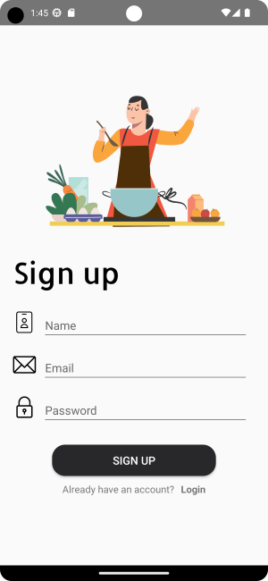

# RecipeApp

## Table of contents
* [General info](#general-info)
* [Technologies](#technologies)
* [Illustrations](#illustrations)

## General info
A cooking app Foodies made with Spoonacular API will simplify your cooking routine, because now you have all  your favorite recipes in one place.
Also it's a great oppurtinity to find new flavors in familiar ingredients and surprise
your family and friends. In Foodies you can explore new recipes, add some of them to your list and try later.

	
## Technologies
Project is created with:
* Android Studio
* Java 17
* Lottie Animations
* Spoonacular API
* Firebase

## Illustrations
 ### Start page                Main Page
 

### Sign Up                     Login
 

### Recipe Page                  Liked Recipes
 
